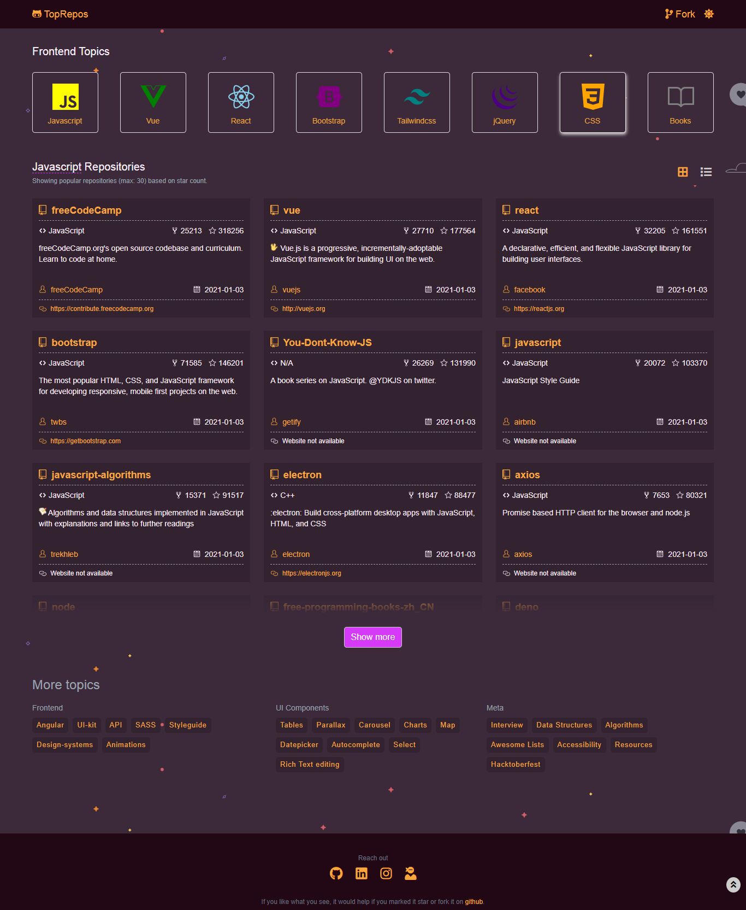

# TopRepos

[](https://app.netlify.com/sites/frontend-repos/deploys)

---

A project using [Github API](https://docs.github.com/en/free-pro-team@latest/rest) to display 30 most popular repositories of a selected topic. It uses vue-router, vuex, axios and hint.css library.



---

### Project setup

```bash
1. Install necessary packages

   npm install
```

```bash
2. Compiles and hot-reloads for development

   npm run serve
```

```bash
3. Compiles and minifies for production

   npm run build
```

---

### Built With

* [VueJS](https://vuejs.org/)
* [TailwindCSS](https://tailwindcss.com/)
* [Github API](https://docs.github.com/en/free-pro-team@latest/rest)

---

### Check it out
[View Demo](https://frontend-repos.netlify.app/)